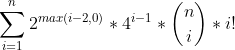

# Countdown Game Solver
This project is meant to solve the following game rounds from the game show Countdown:

1. The Letters Round & Conundrum
2. The Numbers Round

## Notes
### Letters Round
Wordlist was taken from [Aaron Flanagan's Github Gist page](https://gist.github.com/AaronFlanagan20/d1c0a1c8a0a7d539e0ac).

Wordlist may not be perfectly designed to Countdown Game Show rules.

### Numbers

The size of the Numbers Round tree is massive, and can take immensive amount of time after 6 numbers. 
To put in perspective, there is at least:

Where  represents the 
number of possible operations in a set of trees, 
represents a lower bound for the number of parentheses groups in a set of trees, and 
 represents the
number of possible permutations for n numbers in a tree of size i.

***Please use caution when trying more than 6 numbers, especially when you are trying to get all solutions.***

## Rules
### The Letters Round / Conundrum
There are two stacks of shuffled tiles, one stack containing vowels and the other containing consonants.
A contestant picks a stack 9 times to create a selection of letters. 

The contestants must then create the largest word possible
with the letters selected.

Conundrum Round is the same as the Letters Round, 
except it is a combination of words that the contestants must configure into a 9 letter word.

**Example**

The letters selected are:

G Y H D N O E U R

Contestant One declares 7, while Contestant Two declares 8.

Contestant One reveals **younger**, but Contestant Two reveals **hydrogen** and scores 8 points. Contestant One does not score.

Dictionary Corner notes **greyhound**, which would have scored 18 points for using all nine letters.

*For more information, checkout this [Wikipedia article](https://en.wikipedia.org/wiki/Countdown_(game_show)#Letters_round).*

### The Numbers Round
There are 24 shuffled face-down numbers organized into two groups:

1. The Small Numbers, consisting of the numbers 1 to 10 twice for a total of 20 numbers.
2. The Large Numbers, consisting of the numbers 25, 50, 75, 100 for a total of 4 numbers.

A contestant chooses 6 numbers from the two groups and a computer generates a random 3-digit number.
The contestants must then figure out how to use the 6 numbers with arithmetic operators (+, -, *, /) to 
create the randomly-generated 3-digit number.

The contestants do not need to use all 6 numbers to create the 3-digit number.

**Example**

The selected numbers are:

75 50 2 3 8 7

The randomly generated target is:

812

The answer is:

((7 * 2) * (50 + 8)) = 812

*For more information, checkout this [Wikipedia article](https://en.wikipedia.org/wiki/Countdown_(game_show)#Numbers_round).*